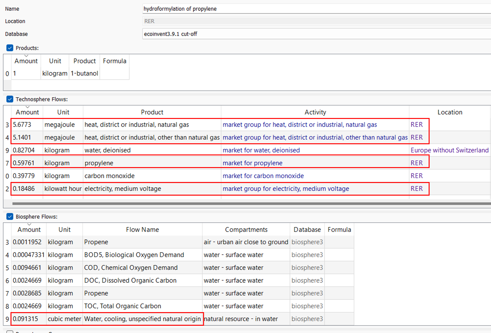
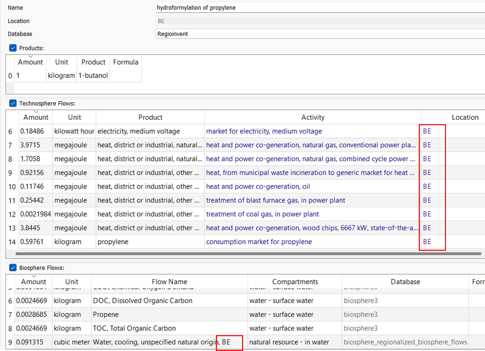

## _Regioinvent_

```Regioinvent``` is a Python package for automatically regionalizing the ecoinvent database using trade data. Copies of 
ecoinvent processes and created and key inputs such as electricity, heat and municipal solid waste are adapted to the
context of the country for which regionalization is being carried out. Elementary flows are also regionalized (water, 
land and acidification/eutrophication) To decide for which to create a regionalized copy of an ecoinvent process, 
export data from the UN COMTRADE database is being used. <br>

Once these regionalized processes are available, consumption markets are also created based this time on the import data
of the UN COMTRADE database and to domestic production levels derived from the EXIOBASE GMRIO database. These consumption
markets are then reconnected to any regionalized process to deepen the regionalization of ecoinvent. <br>

## Illustration

#### Before
Take the process of production of 1-butanol in Europe. It uses the European markets for electricity, medium voltage and
for heat. It also purchases propylene from the European market:



#### After
Once regionalized through Regioinvent, say for production in Belgium, the process now uses electricity and heat mixes
adapted to the Belgian context. It also uses the consumption market of propylene specific to Belgium. Finally, the 
elementary flows are also regionalized to the Belgian context.



## Get started


To get started you can git clone this repository or simply download it.

You will need a few things to get started:
- Have an ecoinvent license (obviously)
- Download the UN COMTRADE database that I already extracted. You can download it from [here](https://doi.org/10.5281/zenodo.11583815)
- Install ```brightway2``` and have a brightway2 project with ecoinvent3.9.1 cut-off

Note that regioinvent currently only supports the ecoinvent 3.9.1 cut-off version and operates solely on brightway2 (NOT 
brightway2.5).

You can then follow the steps presented in the [demo.ipynb](https://github.com/CIRAIG/Regioinvent/tree/master/doc/demo.ipynb) 
Jupyter notebook.

## How to use?
Once the regionalized version of ecoinvent is created, you can perform your LCAs either through brightway2 or its GUI 
activity-browser. <br> There are currently no support for other LCA software, although nothing stops you from exporting a 
brightway project to the other LCA software and see if they have the computation capabilities of working with a 
regionalized version of ecoinvent.

## Documentation

_incoming through a scientific article_

## Support
Contact [maxime.agez@polymtl.ca](mailto:maxime.agez@polymtl.ca)
