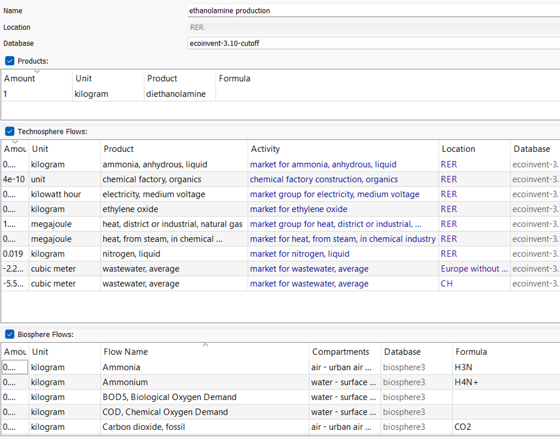
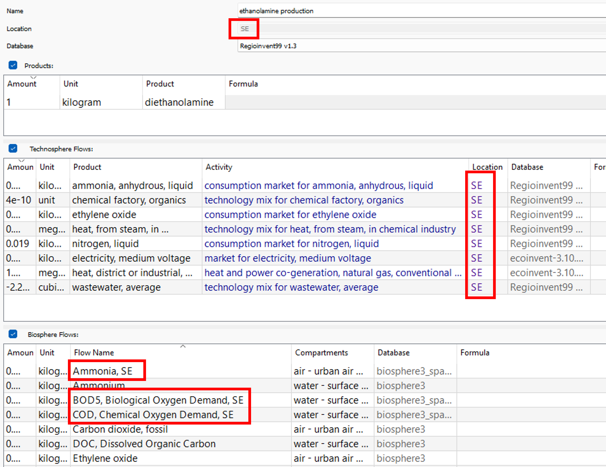

## _Regioinvent_

```Regioinvent``` is a Python package for automatically connecting the _ecoinvent_ database to _BACI_, a trade database.

Connecting to a trade database enables a more realistic description of average supply chains within the ecoinvent database
through the introduction of consumption markets, based on international import data and production data. The result is a
version of ecoinvent which almost does not rely on non-national processes such as RER, RoW or GLO.

Furthermore, since the resulting regionalized version of ecoinvent relies much less on broad regions, the regionalization
of impacts can show its full potential. Therefore, ```Regioinvent``` also fully spatializes all relevant elementary flows
and connects these spatialized elementary flows to regionalized life cycle impact assessment methods. Currently, only 
the IMPACT World+ LCIA method is available. Later on, we plan on adding ReCiPe and EF as well.

## Showcase
To showcase what ```Regioinvent``` does, let's illustrate on an example: the production of diethanolamine in Sweden. 
The production of diethanolamine in ecoinvent is also available for RER and RoW.

Screenshot below shows the starting point of this example: the diethanolamine production process for Europe.




After running ```Regioinvent``` three types of processes are created.
1. National production processes <br>

Below you can see the example for the Swedish production but the code also created such production processes for many countries.



2. National consumption markets <br>

Below you can see the example for the Swedish consumption market but the code also created such consumption markets for many countries.


3. A global export market <br>

The global export market shows the biggest exporters of the commodity worldwide.


## ```Regioinvent``` in your LCAs
Use the three types of processes generated with ```Regioinvent``` as follows:
- If you know where the production of your commodity occurs, select the corresponding national production process. Either
for the location exactly, or, if unavailable, the RoW version which is an aggregate of all the countries not being in the
biggest producers.
- If you don't know where the production of your commodity occurs, BUT you know where it was bought, rely on the consumption
markets. These describe where the commodity should come from on average, given the trade of the region.
- If you don't know anything about the process, you can either use the RoW or GLO process of ecoinvent, or rely on the 
global export process of ```Regioinvent``` as a proxy. Note however that it is an export market. It does not include the
domestic production in the shares of that market.

## Get started


To get started you can git clone this repository or simply download it.

You will need a few things to get started:
- Have an ecoinvent license (obviously)
- Download the BACI database that was already extracted.
You can download it from [here](https://doi.org/10.5281/zenodo.11583814)
- Install ```brightway2``` and have a brightway2 project with either ecoinvent3.9.1 cut-off or ecoinvent3.10 cut-off

Note that regioinvent currently only supports the ecoinvent 3.9.1/3.10 cut-off version and operates solely on brightway2 (NOT 
brightway2.5).

You can then follow the steps presented in the [demo.ipynb](https://github.com/CIRAIG/Regioinvent/tree/master/doc/demo.ipynb) 
Jupyter notebook.

Required python version: 3.11

## How to use after running the code?
Once the regionalized version of ecoinvent is created on Python, you can export it to brightway2. You will then be able to
perform your LCAs either through brightway2 or its GUI activity-browser as you would with the regular ecoinvent database. <br> 
Do note that calculations are longer with ```Regioinvent``` (~5 to 10 minutes calculation for the first run). <br>
There are currently no support for other LCA software, as SimaPro and openLCA are not able to support the size of the database.

## Overview of the methodology


1. Closest available process in ecoinvent is copied and adapted for electricity, heat and waste inputs
2. National consumption markets are created based on import and production data
3. The national consumption markets are connected to the rest of the database
4. Elementary flows are spatialized

For the detailed methodology, take a look at the Methodology.md file.

## Adaptations
- ```Regiopremise``` (https://github.com/matthieu-str/Regiopremise) is an adaptation of regioinvent that can work with the 
```premise``` library (https://github.com/polca/premise) and can operate with a regionalized EF3.1 version.

## Support
Contact [maxime.agez@polymtl.ca](mailto:maxime.agez@polymtl.ca)

## Citation
Citing the code (take the correct version): https://doi.org/10.5281/zenodo.11836126 <br>
Citing the article: _article currently in review_ <br>
Citing BACI: Gaulier, G. and Zignago, S. (2010) BACI: International Trade Database at the Product-Level. The 1994-2007 Version. CEPII Working Paper, N°2010-23.
